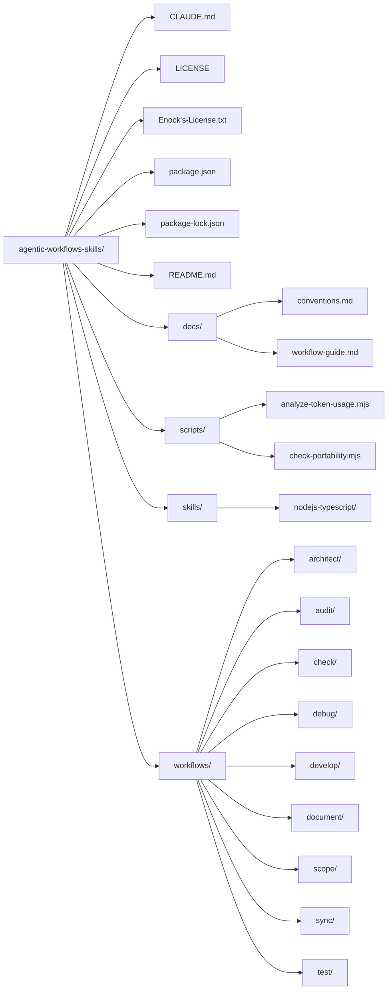

# Enock's Agentic Workflows & Skills


[](https://skills.sh/Enockkipkoech/agentic-workflows-skills)


## Core concept:
- Reusable Skills + Composable Workflows.
- A collection of reusable Agent Skills and repeatable workflows for
software engineering, backend development, Web3, DevOps, security,
research, and technical problem solving.

## Installation

### Install the collection

```bash
npx skills@latest add Enockkipkoech/agentic-workflows-skills/skills && npx skills@latest add Enockkipkoech/agentic-workflows-skills/workflows 
```

### Install with a specific agent(claude-code, copilot,  gpt-5, codex,kimi etc.)
```bash
npx skills@latest add Enockkipkoech/agentic-workflows-skills && npx skills@latest add Enockkipkoech/agentic-workflows-skills/workflows \
  -a claude-code
 ``` 

 ### commands
 ```bash
npx skills@latest add Enockkipkoech/agentic-workflows-skills/skills && npx skills@latest add Enockkipkoech/agentic-workflows-skills/workflows \
  --list

npx skills@latest add Enockkipkoech/agentic-workflows-skills \
  --skill nodejs-typescriptSelect

 ```

### skills
```bash
/nodejs-typescript
/javascript
/testing
/backend-engineering
/api-design
/database-design
/distributed-systems
/blockchain-web3
/solidity
/evm
/defi
/docker
/kubernetes
/cloud
/ci-cd
/application-security
/api-security
/smart-contract-security
``` 

### workflows
```bash
/architect
/scope
/audit
/check
/debug
/develop
/document
/sync
/test
/research
/software-development
/code-review
/security-audit
/system-design
/technical-interview
```

### Skill Templates

- Use When -> Don't Use When -> Workflow -> Rules -> Examples ->  Edge Cases -> References

## Repository Structure


Layout of `agentic-workflows-skills/` at two depths. Regenerate the raw listings with:


## Level 2 tree



## Philosophy

These skills are designed around:

Clear instructions
Reusable knowledge
Repeatable workflows
Progressive disclosure
Production-oriented engineering
Security-conscious development
Evidence-based research

## Author
 **Enock Kipkoech**

GitHub: **https://github.com/Enockkipkoech**    

## License

Copyright © 2026 Enock Kipkoech.

This project is proprietary software. See the [LICENSE](Enock's-License.txt) file for
the terms governing its use, modification, and distribution.

### EDUCATIONAL PURPOSES ONLY
This project is licensed under the MIT License - see the [LICENSE](https://opensource.org/licenses?categories=non-reusable) file for details

